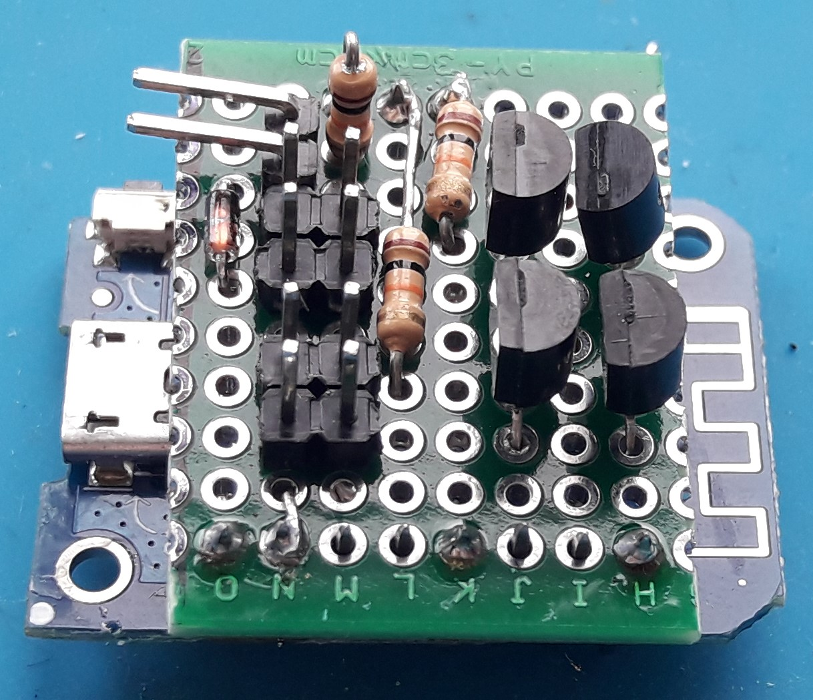

This is a small device that can be placed between the PC motherboard and its power button. And allows you to turn the pc on via an http request or the traditional power button.

- [Why](#why)
- [How does it work](#how-does-it-work)
- [Who to build it](#who-to-build-it)
  - [Compile and upload](#compile-and-upload)
    - [Endpoints](#endpoints)
  - [Hardware](#hardware)
    - [Connecting](#connecting)
      - [Power](#power)
      - [Status](#Status)
      - [Power and reset buttons](#power-and-reset-buttons)
  - [Configure Home Assistant](#configure-home-assistant)

# Why

I am using my PC located on the second floor to stream games to the TV in the living room. Because I'm lazy I needed a reliable way to turn the pc on and off without pressing the physicle button.

WOL is no option because it reqiures the PC to be in sleep mode and I cannot garantee that.


# How does it work

A micro controller with WiFi sits between the power/reset button and the motherboard. It implements a webserver with dedicated endpoints that are able to mimic the button press.

All actions are intergrated in [Home Assistant](https://www.home-assistant.io/)


# Who to build it

This requires 3 things
- Compile and upload code to a micro controller
- Build a small hardware extension
- Configure Home Assistant

## Compile and upload

I used a [WeMos D1 R1](https://www.wemos.cc/en/latest/d1/d1_mini.html) clone board for this and the Arduino IDE.

Copy `dummy.config.h` to `config.h` and change the values accordingly.

Default we use the following pins:
- `D6` for power switch
- `D7` for the reset pin
- `D5` to read the current on status

Default for pressing the power or reset button is 100ms. According to my motherboard manual (Asus ROG Strix z390-E) pressing the button for 4 seconds will turn the machine off.

Compile and upload the code to the board.

When connected to the WiFi the build in LED will turn on. At this point you can get the IP address from your router or simular.

### Endpoints
- `/status`
- `/power-on`
- `/power-off`
- `/power-toggle`
- `/reset`
- `/force-off`

All endpoints return the same JSON response, containing the current status of the PC.

Simply use CURL to test the device.
```shell
curl -v http://192.168.0.5/status
```
```json
{"status":"off"}
```


## Hardware

Things you need
- WeMos D1 Mini
- 4x NPN transistors
- 3x 10KOhm resistors
- 1x diode
- 6-12 headers pins (depends if you want to use the original buttons and pc speaker)

The schema:


My result, this is the board I'm using right now:



### Connecting

I'm using a Asus ROG Strix z390-E motherboard. The code or the schema may not be compatible with your motherboard. Use a multimeter to verify everything before you break your motherboard.

This is the System panel connector pinout:


#### Power
On my motherboard I found that the usb2.0 headers are always powered. So I modified an old micro-USB cabel to use the header and connect it to the Wemos D1 (Note I ommited the data lines, I don't want my PC to communicate with the board).

#### Status
I found the Speaker 5V+ pin is only powered when the PC is on. This is likely to not be the case for other boards. You might need to find another way (maybe the power LED?).

The `/power-on` and `/power-off` endpoints are using the status and will only act if the system in is the opossite state.
Without a status, you can still use the `/power-toggle`.

#### Power and reset buttons
On the motherboard, both buttons have a ground and input pin (normaly high). Pressing the button will pull the value low.

Connect the corresponding PwrBtn, PwrGnd, RstBtn and RstGnd to the device. Optionaly connect the case power/restart buttons if you want to use those.

If the PC keeps turning on/off, the Btn and Gnd pins are inverted.


## Configure Home Assistant

I use the Home Assistant app on my phone to controll the device. Feel free to use whatever you want. Even browser bookmarks will work.

This is the configuration I used:
```yaml
# These are to create buttons without any state (perfect for reset)
input_button:
  pc_02_reset:
    name: PC reset
    icon: mdi:desktop-classic
  pc_02_forceoff:
    name: PC force off
    icon: mdi:desktop-classic
# A rest sensor will get the current status every 5 seconds
sensor:
  - platform: rest
    resource: http://192.168.0.5/status
    scan_interval: 5
    name: "pc_02_status"
    value_template: "{{ value_json.status }}"
# A on/off switch, using the actual status collection via the rest sensor
switch:
  - platform: template
    switches:
      pc_02_switch:
        value_template: "{{ is_state('sensor.pc_02_status', 'on') }}"
        turn_on:
          - service: rest_command.pc_02_on
        turn_off:
          - service: rest_command.pc_02_off
# All actions, make sure to update the IP address or get it from the secrets.yaml
rest_command:
  pc_02_on:
    url: "http://192.168.0.5/power-on"
  pc_02_off:
    url: "http://192.168.0.5/power-off"
  pc_02_toggle:
    url: "http://192.168.0.5/power-toggle"
  pc_02_reset:
    url: "http://192.168.0.5/reset"
  pc_02_forceoff:
    url: "http://192.168.0.5/force-off"
# The automations reacton on triggers, when from input_button the reset or forceoff buttons are pressed
automation:
  pc_02_reset:
    description: ''
    trigger:
    - platform: state
      entity_id:
      - input_button.pc_02_reset
    condition: []
    action:
    - service: rest_command.pc_02_reset
      data: {}
    mode: single
  pc_02_force_off:
    description: ''
    trigger:
    - platform: state
      entity_id:
      - input_button.pc_02_forceoff
    condition: []
    action:
    - service: rest_command.pc_02_forceoff
      data: {}
    mode: single
```

And this is the dashboard panel. It implements all the actions from the device.
```yaml
type: entities
entities:
  - entity: sensor.pc_02_status
  - entity: switch.pc_02_switch
  - entity: input_button.pc_02_reset
  - entity: input_button.pc_02_forceoff
title: PC Status
```

